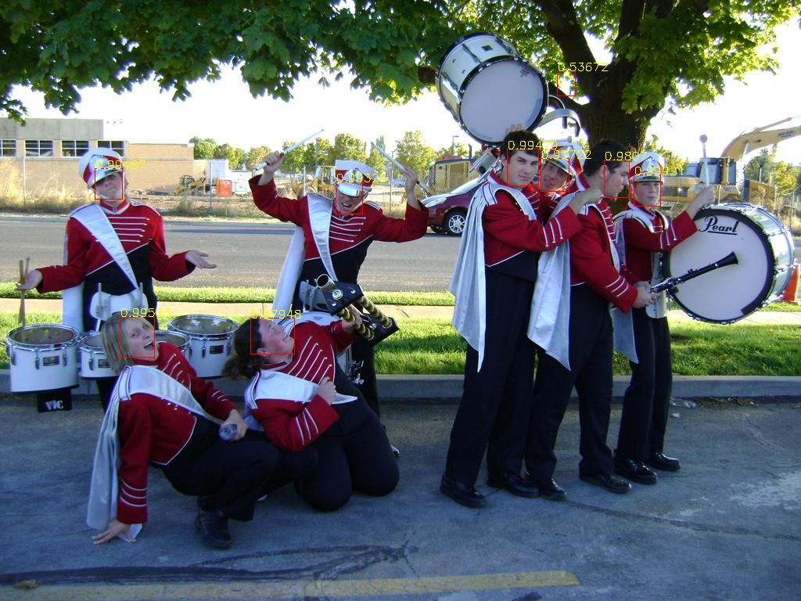

# Face Detection
<div align="center">

English | [简体中文](README_zh-CN.md)

</div>

## Introduction
MindFace is an open source toolkit based on MindSpore and currently contains state-of-the-art face recognition and detection models such as ArcFace, RetinaFace, etc. MindFace has a unified application programming interface and powerful scalability for common application scenarios such as facial recognition and detection.

This is a face detection repository for the MindFace. The deep learning models currently available for users are RetinaFace network models based on different backbone networks (ResNet50 and MobiletNet0.25). RetinaFace is a single-stage SOTA face detector which is accepted by [CVPR 2020](https://openaccess.thecvf.com/content_CVPR_2020/html/Deng_RetinaFace_Single-Shot_Multi-Level_Face_Localisation_in_the_Wild_CVPR_2020_paper.html). The ResNet50-based version we implemented provides better performance, while the MobileNet0.25-based version is faster to detect.


# Results
### WiderFace Val Performance in multiscale.
| backbone | Easy | Medium | Hard |
|:-|:-:|:-:|:-:|
| MobileNet0.25 | 91.60% | 89.50% | 82.39% |
| ResNet50 | 95.81% | 94.89% | 90.10% |

### WiderFace Val Performance in single scale When using ResNet50 as backbone.
| Style | Easy | Medium | Hard |
|:-|:-:|:-:|:-:|
| MindSpore (same parameter with MXNet) | 94.46% | 93.64% | 89.42% |
| MindSpore (original image scale) | 95.07% | 93.61% | 84.84% |
| PyTorch (same parameter with MXNet) | 94.82 % | 93.84% | 89.60% |
| PyTorch (original image scale) | 95.48% | 94.04% | 84.43% |
| MXNet | 94.86% | 93.87% | 88.33% |
| MXNet(original image scale) | 94.97% | 93.89% | 82.27% |

### WiderFace Val Performance in single scale When using MobileNet0.25 as backbone.
| Style | Easy | Medium | Hard |
|:-|:-:|:-:|:-:|
| MindSpore (same parameter with MXNet) | 88.51% | 86.86% | 80.88% |
| MindSpore (original image scale) | 90.77% | 88.20% | 74.76% |
| PyTorch (same parameter with MXNet) | 88.67% | 87.09% | 80.99% |
| PyTorch (original image scale) | 90.70% | 88.16% | 73.82% |
| MXNet | 88.72% | 86.97% | 79.19% |
| MXNet(original image scale) | 89.58% | 87.11% | 69.12% |


## Quick Start


1. Installation

    1.1 Git clone this [repo](https://openi.pcl.ac.cn/OpenModelZoo/MindFace_Detection) and install MindFace.

    ```shell
    git clone https://openi.pcl.ac.cn/OpenModelZoo/MindFace_Detection.git
    cd mindface
    python setup.py install
    ```

    1.2 Install dependencies

    ```
    cd mindface/detection/
    pip install -r requirements.txt
    ```

2. Prepare Data

    2.1. Download WiderFace dataset and annotations that we used from [baidu cloud](https://pan.baidu.com/s/1eET2kirYbyM04Bg1s12K5g?pwd=jgcf) or [google drive](https://drive.google.com/file/d/1pBHUJRWepXZj-X3Brm0O-nVhTchH11YY/view?usp=sharing).
    


    2.2. Organise the dataset directory under mindface/detection/ as follows:
    ```
    data/WiderFace/
        train/
            images/
            label.txt
        val/
            images/
            label.txt
        ground_truth/
            wider_easy_val.mat
            wider_medium_val.mat
            wider_hard_val.mat
            wider_face_val.mat
    ```
3. Set Config File

    You can Modify the parameters of the config file in ```./configs```.

    We provide two versions of configs ([RetinaFace_mobilenet025](./configs/RetinaFace_mobilenet025.yaml) and [RetinaFace_resnet50](./configs/RetinaFace_resnet50.yaml)).


4. Training

    It is easy to train your model using `train.py`, where the training strategy (e.g., augmentation, LR scheduling) can be configured with external arguments or a yaml config file.

    - Standalone Training
    ```shell
        python mindface/detection/train.py --config mindface/detection/configs/RetinaFace_mobilenet025.yaml
    ```

    - Distributed Training

        To run in distributed mode, [openmpi](https://www.open-mpi.org/software/ompi/v4.0/) is required to install.  

    ```shell
        export CUDA_VISIBLE_DEVICES=0,1,2,3  # 4 GPUs
        mpirun -n 4 python mindface/detection/train.py --config mindface/detection/configs/RetinaFace_mobilenet025.yaml
    ```

    > note: if your device is Ascend, please set the "device_target" in the config file to "Ascend".

5. Validation

    To evalute the model performance, please run `eval.py` 
```
    python eval.py --config mindface/detection/configs/RetinaFace_mobilenet025.yaml --checkpoint pretrained/weight.ckpt
```

6. Inference

    To infer a single image, please run `infer.py`
```shell
    python infer.py --config mindface/detection/configs/RetinaFace_mobilenet025.yaml --checkpoint pretrained/weight.ckpt --image_path ./imgs/0000.jpg --conf 0.5
```

## Oepni cluster training
1. If it is Resnet50, you need to specify the pre-training model, which is the public model Pretrained_resnet50; if it is Mobilenet, you don't need to specify the pre-training model
2. Select MindSpore-1.7, select the startup file as mindface/detection/train.py, select the dataset as WiderFace.zip in the public dataset
3. Select NPU: 1*Ascend 910, CPU: 24, Video Memory: 32GB, Memory: 256GB
4. Configure operational parameters:
    config RetinaFace_resnet50.yaml / RetinaFace_mobilenet025.yaml
5. Create a new task and start running

## Oepni Cluster Inference
1. Specify the previously trained exported model, Retinaface_resnet50 / Retinaface_mobilenet025
2. Select MindSpore-1.7, select the start file as mindface/detection/eval.py, select the dataset as WiderFace.zip in the public dataset
3. Select NPU: 1*Ascend 910, CPU: 24, Video Memory: 32GB, Memory: 256GB
4. Configure operational parameters:
    config RetinaFace_resnet50.yaml / RetinaFace_mobilenet025.yaml
5. Create a new task and start running


## Demo
The inference results by using our pre-trained weights are shown in the following figure.



## RetinaFace Pretrained Models

You can download our pretrained model of [RetinaFace-ResNet50](https://download.mindspore.cn/toolkits/mindface/retinaface/RetinaFace_ResNet50.ckpt) and  [RetinaFace-MobileNet025](https://download.mindspore.cn/toolkits/mindface/retinaface/RetinaFace_MobileNet025.ckpt).

You can verify the results in the [table](#widerface-val-performance-in-single-scale-when-using-resnet50-as-backbone-net) with the downloaded pretrained model.


## References
- [Retinaface (MXNet)](https://github.com/deepinsight/insightface/tree/master/detection/retinaface)
- [Retinaface (PyTorch)](https://github.com/biubug6/Pytorch_Retinaface)
```
@inproceedings{deng2019retinaface,
title={RetinaFace: Single-stage Dense Face Localisation in the Wild},
author={Deng, Jiankang and Guo, Jia and Yuxiang, Zhou and Jinke Yu and Irene Kotsia and Zafeiriou, Stefanos},
booktitle={arxiv},
year={2019}
```


